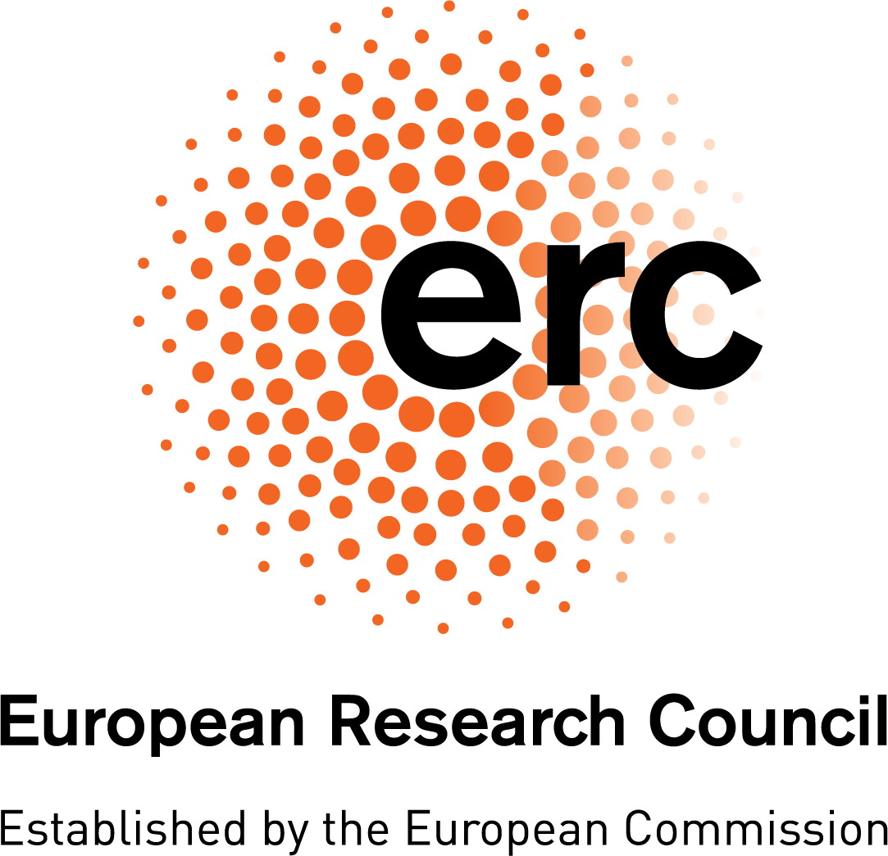
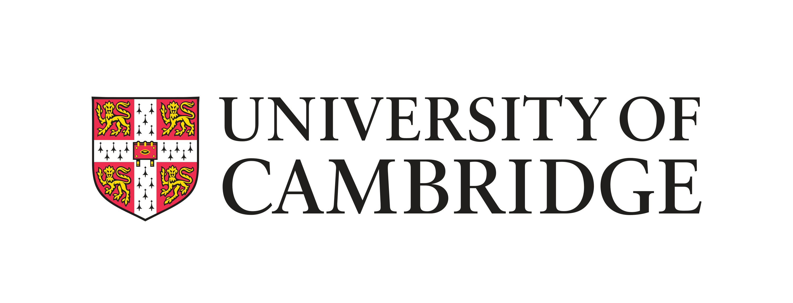
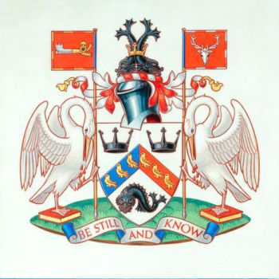
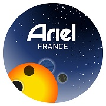

::: {.hero}
# Professional Experience
    
**Research Engineer for CNRS in Exoplanetary Science at the Paris Observatory**

I work on detecting new exoplanets using astrometry, direct imaging and radial velocities. I am part of the COBREX project, which is funded by the European Research Council (ERC) under the European Union’s Horizon 2020 research and innovation program.

{width=20%}
{width=20%}

:::

# Education

## Bachelor of Arts, Natural Sciences
::: {.grid}
::: {.g-col-6}
**University of Cambridge**  
_Physics specialisation_  
October 2021 - June 2024  
Cambridge, UK 
:::
::: {.g-col-6}

{width=90%}

:::
:::

## Master of Science, Astronomy
::: {.grid}
::: {.g-col-6}
**University of Sussex**  
September 2024 - September 2025  
Brighton, UK 
:::
::: {.g-col-6}
{width=40% fig-align="center"}
:::
:::

# Professional Training

## ARIEL ExoClock Training Programme
::: {.grid}
::: {.g-col-9}
**Observatoire des Baronnies Provençales**  
May 2026  
Moydans, France 

- Received training in performing observations at the Observatoire des Baronnies Provençales in the French Prealps.
- Obtained exoplanet transit photometry by performing remote observations from Deep Sky Chile.
- Analysed time-series using HOPS and Muniwin to detect transit timing variations (TTVs).

:::
::: {.g-col-3}
{width=90% fig-align="center"}
:::
:::

# Technical Skills

## Programming

- 5 years of experience with Python-based data analysis
- Analysis of FITS files for JWST spectroscopy and photometry
- Exoplanet detection using Gaia astrometry with GaiaPMEX
- Libraries used: NumPy, Pandas, SciPy, Astropy, Cosmos-Synthesizer, Matplotlib, Emcee, Unyt

## Astronomy

- Amateur astronomer since 2016, with experience using binoculars and telescopes to observe Solar System objects such as planets and comets, and deep-sky objects such as galaxies and nebulae
- Experience in astrophotography of the Moon, planets, and deep-sky objects. Notable images include the 2020 Jupiter-Saturn conjunction, and a double solar eclipse on Jupiter by the moons Europa and Ganymede
- Certified and trained to operate the Northumberland telescope at Cambridge, which is a 200-year old 12-inch refractor

## Lab and instrumentation

- Spectroscopy & diffractometers: characterisation of molecules and crystal lattices
- Oscilloscopes and signal generators: investigation of various op-amp circuits
- Wavetanks: analysis of wave propagation and attenuation
- Optical benches (with lenses, mirrors, and lasers to measure diffraction), optical microscopy
- Experience using Micro:bits to build clocks and step counters

## 3D design and printing

- Experience using 3D printers and scanners to create a space capsule model to test aerodynamic forces, and a gear system for a clock.