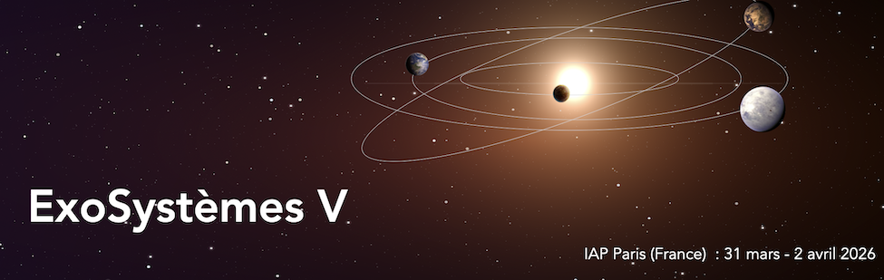
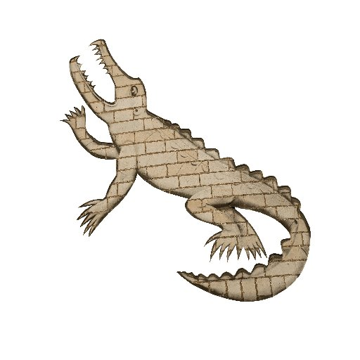

# Conference Presentations

## Elbereth 2026  
::: {.grid}
::: {.g-col-6}
10 April 2026  
**Institut d'astrophysique de Paris**  
Paris, France   
Contributed research talk: _Searching for planetary companions around solar-type stars within 25 pc using Gaia astrometry_  
[My Presentation (PDF)](documents/Presentation.pdf){target="_blank"}
:::
::: {.g-col-6}

{width=90%}

:::
:::

## ExoSystèmes V  
::: {.grid}
::: {.g-col-6}
1 April 2026  
**Institut d'astrophysique de Paris**  
Paris, France   
Poster presentation: _Searching for planetary companions around solar-type stars within 25 pc using Gaia astrometry_  
[My Poster (PDF)](documents/Poster.pdf){target="_blank"}
:::
::: {.g-col-6}
{width=90% fig-align="center"}
:::
:::

## On the Shoulders of Giants  
::: {.grid}
::: {.g-col-6}
25 March 2026  
**Istituto Nazionale di Astrofisica**  
Turin, Italy   
Poster presentation: _Searching for planetary companions around solar-type stars within 25 pc using Gaia astrometry_  
[My Summary Slide (PDF)](documents/Summary Slide.pdf){target="_blank"}
:::
::: {.g-col-6}
{width=90% fig-align="center"}
:::
:::

## MPIE 2025  
::: {.grid}
::: {.g-col-6}
2 September 2025  
**University of Sussex**  
Brighton, UK   
Contributed research talk: _Probing the Stellar Populations of Distant Galaxies using the Balmer Break: Validating Galaxy Formation Models_
:::
::: {.g-col-6}

{width=90%}

:::
:::

## Cavendish Laboratory Poster Session  
::: {.grid}
::: {.g-col-6}
12 February 2023  
**University of Cambridge**  
Cambridge, UK   
Poster presentation: _Atomic Spectral Lines_
:::
::: {.g-col-6}
{width=50% fig-align="center"}
:::
:::